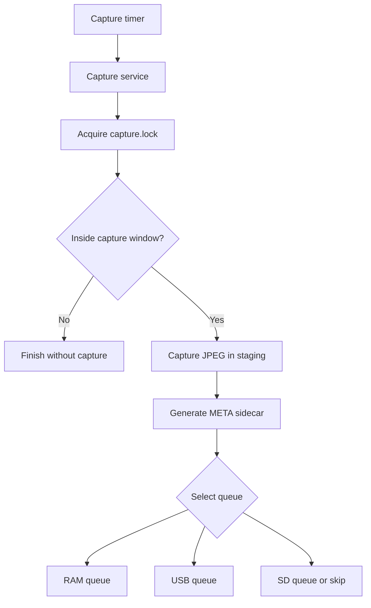
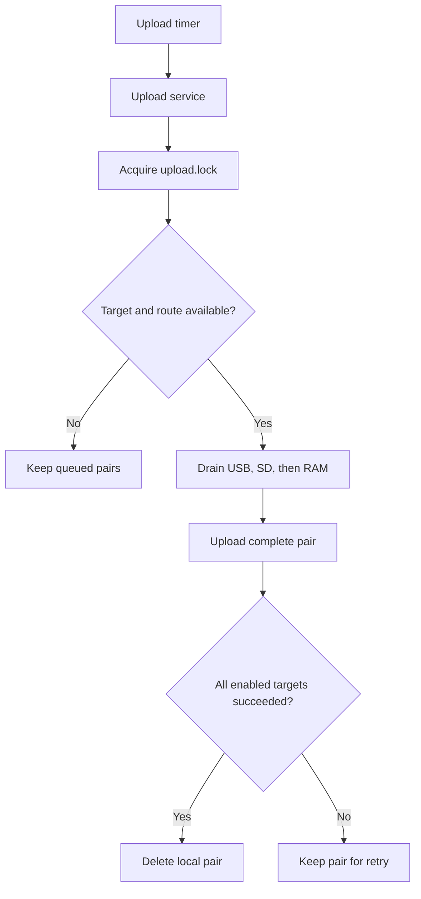

# Software Architecture

OSCARS-PHENOCAM is composed of `systemd` units, executable entry points, reusable shell modules, configuration files, and three storage queues.

Capture and upload are independent processes. They can run concurrently and use separate locks.

---

## Deployed Components

| Path                              | Purpose                                      |
| --------------------------------- | -------------------------------------------- |
| `/opt/oscars-phenocam`            | Local copy of the Git repository             |
| `/usr/local/lib/phenocam/bin`     | Executable entry points and diagnostics      |
| `/usr/local/lib/phenocam/scripts` | Capture, metadata, storage, and upload logic |
| `/usr/local/lib/phenocam/docs`    | Installed documentation                      |
| `/etc/phenocam`                   | Station and upload configuration             |
| `/run/phenocam`                   | Volatile runtime storage and locks           |
| `/var/lib/phenocam/queue`         | Persistent SD-card fallback queue            |
| `/var/log/phenocam`               | Application log directory                    |

The runtime services use the dedicated `phenocam` system user. The installer adds this user to the `video` group for camera access.

---

## Runtime Layers

| Layer         | Components              | Responsibility                                                          |
| ------------- | ----------------------- | ----------------------------------------------------------------------- |
| Scheduling    | `systemd` timers        | Starts capture, upload, and startup-test operations                     |
| Execution     | `software/bin/*.sh`     | Provides locked entry points and diagnostics                            |
| Processing    | `software/scripts/*.sh` | Implements acquisition, metadata, queues, network selection, and upload |
| Configuration | `/etc/phenocam/*`       | Supplies station and remote-destination values                          |
| Storage       | RAM, USB, and SD queues | Retains complete image and metadata pairs                               |

---

## Boot Sequence

At boot, `phenocam-init.service` executes:

```text
/usr/local/lib/phenocam/bin/phenocam-init-ramdisk.sh
```

The script:

1. reads the total system memory;
2. calculates a RAM-disk size equal to 20% of total memory;
3. applies a minimum size of 50 MB;
4. updates `run-phenocam.mount` with the numeric `phenocam` user and group IDs;
5. starts or updates the `/run/phenocam` `tmpfs`;
6. creates the `queue` and `staging` directories.

If the mount is already active and contains `.jpg` or `.meta` files, it is not restarted when its options change.

The startup timer then requests one capture-and-upload cycle approximately two minutes after boot. The capture step may produce no image when the station is outside its configured acquisition window.

---

## Capture Flow



The capture service executes:

```text
phenocam-capture.sh
  └─ cycle.sh
      ├─ config_read.sh
      ├─ capture_vis.sh
      ├─ meta_build.sh
      ├─ storage_manager.sh
      └─ queue_manager.sh
```

### Capture Sequence

1. `phenocam-capture.sh` acquires `/run/phenocam/capture.lock`.
2. `cycle.sh` loads `/etc/phenocam/settings.txt`.
3. The current station hour is compared with the acquisition window.
4. Previous `.jpg` and `.meta` files left in staging are removed.
5. `capture_vis.sh` creates the JPEG.
6. `meta_build.sh` creates the corresponding sidecar.
7. `queue_manager.sh` moves the complete pair into the selected queue.

Image acquisition uses `rpicam-still` when available and falls back to `libcamera-still`.

---

## Queue Selection

```text
RAM → USB → SD → capture skipped
```

Queue selection follows these rules:

1. use RAM when its free space is at or above `RAM_MIN_FREE_MB`;
2. otherwise use the first writable mounted filesystem found below `USB_MOUNT_BASES`;
3. use USB only when its usage is below `USB_MAX_USED_PCT`;
4. otherwise use the SD queue;
5. skip the capture when SD usage is at or above `SD_MAX_USED_PCT`.

| Queue | Path                          |
| ----- | ----------------------------- |
| RAM   | `/run/phenocam/queue`         |
| USB   | `<mountpoint>/phenocam_queue` |
| SD    | `/var/lib/phenocam/queue`     |

RAM is volatile. USB and SD queues persist independently of the RAM-backed filesystem.

---

## Atomic Pair Publication

Images and metadata are first generated in:

```text
/run/phenocam/staging
```

Queue insertion uses temporary names:

```text
<basename>.jpg.tmp
<basename>.meta.tmp
```

The JPEG is renamed to its final name before the metadata file receives its final name.

The uploader discovers work by listing final `.meta` files. Therefore, when a metadata file becomes visible to the uploader, the corresponding final JPEG already exists.

This mechanism allows capture and upload to operate independently without exposing a partially published pair.

---

## Upload Flow



The upload service executes:

```text
phenocam-upload.sh
  ├─ config_read.sh
  ├─ net_check.sh
  ├─ storage_manager.sh
  ├─ upload_sftp.sh
  ├─ upload_ftp.sh
  └─ uploader_daemon.sh
```

### Upload Sequence

1. `phenocam-upload.sh` acquires `/run/phenocam/upload.lock`.

2. The current configuration is loaded.

3. FTP and SFTP activation is determined from their configuration files.

4. Internet availability is checked through the routing table.

5. Queues are processed in this order:

   ```text
   USB → SD → RAM
   ```

6. Only complete `.jpg` and `.meta` pairs are processed.

7. The pair is removed only after every enabled protocol succeeds.

When both FTP and SFTP are enabled, both are attempted for each pair.

No per-destination delivery state is stored. If one enabled target succeeds and another fails, the retained pair is offered to all enabled targets again during the next upload cycle.

---

## Failure Behaviour

| Condition                         | Result                                            |
| --------------------------------- | ------------------------------------------------- |
| Invalid `settings.txt`            | The requested service fails                       |
| Outside acquisition window        | Capture ends successfully without producing files |
| Camera failure                    | Capture service fails                             |
| Metadata failure                  | Capture service fails                             |
| SD usage threshold reached        | Staged pair is removed and capture is skipped     |
| No upload method configured       | Upload ends without removing queued files         |
| No internet route at upload start | Upload is postponed                               |
| Upload target failure             | Pair remains queued for retry                     |
| Incomplete queue pair             | Pair is ignored and remains in place              |
| Existing operation lock           | The duplicate operation fails immediately         |

Files left in staging after a failed capture cycle are removed at the beginning of the next eligible capture cycle.

---

## USB Event Handling

The installed `udev` rule starts dedicated handlers for USB block-device insertion and removal.

On insertion, the attach handler waits for an external automount process and then searches for the first writable mount below the configured base paths. It creates:

```text
<mountpoint>/phenocam_queue
```

The handler does not mount the filesystem itself.

On removal, the detach handler checks configured mount locations, performs a lazy unmount when an inaccessible stale mount remains, and removes orphan `.tmp` files from the SD queue.

---

## Manual Wrapper

`phenocam-run.sh` executes one capture request followed by one upload request.

No installed `systemd` unit calls this wrapper in v1.7.0. Regular operation uses the dedicated capture, upload, and startup-cycle services.

---

[Configuration](CONFIGURATION.md) · [Operations](OPERATIONS.md) · [Back to the project README](../../README.md)
