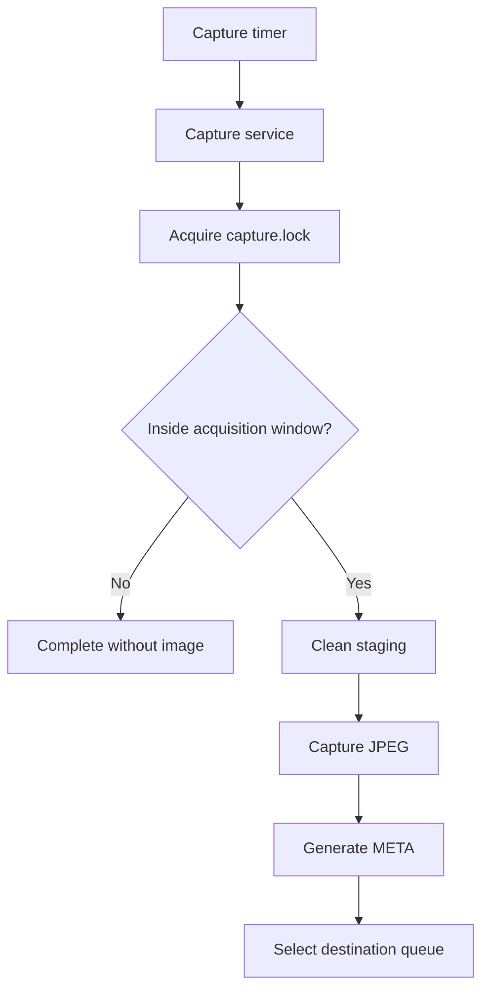
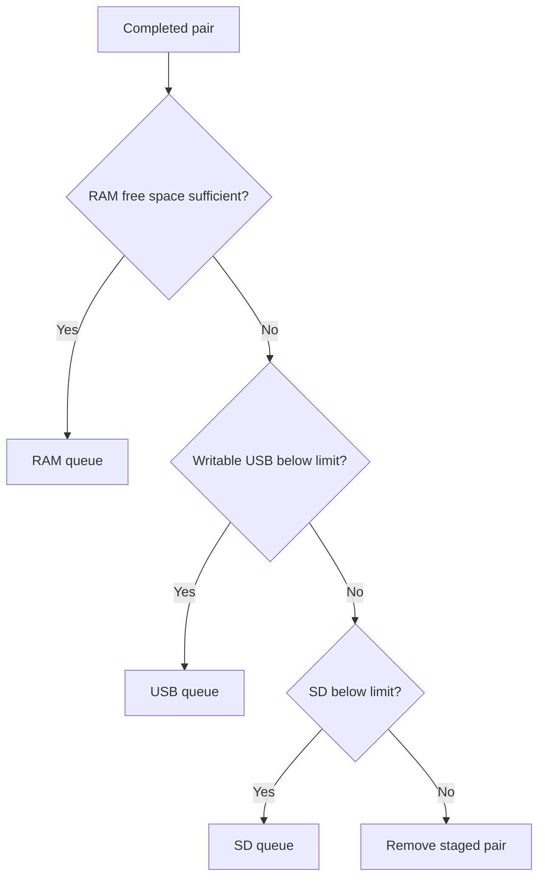
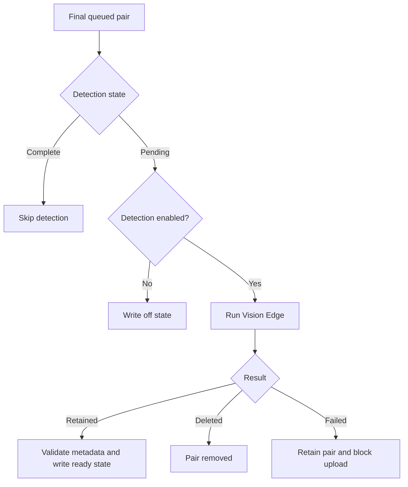
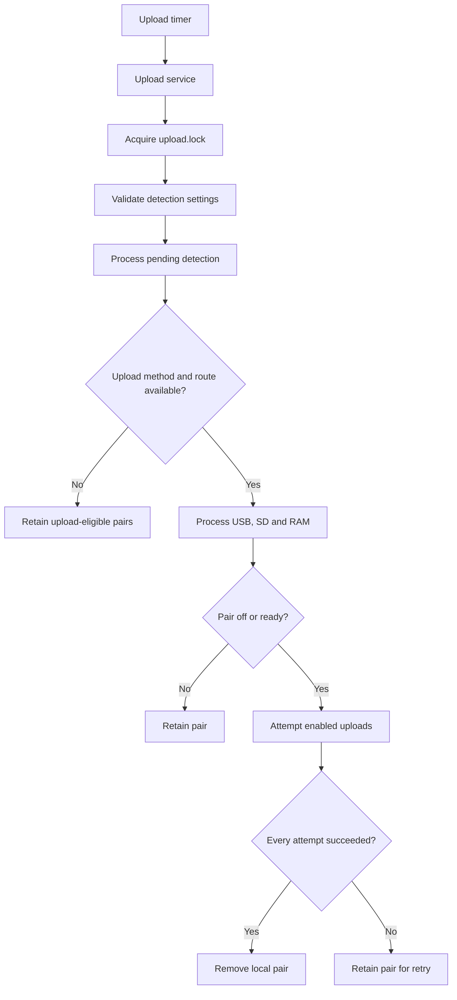

# Software Architecture

OSCARS-PHENOCAM is composed of `systemd` units, executable entry points,
reusable shell and Python modules, configuration files, a pinned Vision Edge
runtime and three storage queues.

Capture uses `capture.lock`. Detection and upload execute sequentially while
holding `upload.lock`. Capture can therefore run concurrently with the
detection/upload cycle, but detection and upload cannot overlap each other.

---

## Deployed Components

| Path                              | Purpose                                     |
| --------------------------------- | ------------------------------------------- |
| `/opt/oscars-phenocam`            | Local copy of the Git repository            |
| `/usr/local/lib/phenocam/bin`     | Executable entry points and diagnostics     |
| `/usr/local/lib/phenocam/scripts` | Capture, metadata, storage, detection and upload logic |
| `/usr/local/lib/phenocam/docs`    | Installed documentation                     |
| `/opt/phenocam-vision-edge-0.2.3` | Pinned Vision Edge runtime, model and receipt |
| `/etc/phenocam`                   | Station and upload configuration            |
| `/run/phenocam`                   | Volatile runtime storage and locks          |
| `/var/lib/phenocam/queue`         | Persistent SD fallback queue                |
| `/var/log/phenocam`               | Application log directory                   |

Runtime services use the dedicated `phenocam` system user. The installer adds this user to the `video` group.

---

## Runtime Layers

| Layer         | Components              | Responsibility                                                 |
| ------------- | ----------------------- | -------------------------------------------------------------- |
| Scheduling    | `systemd` timers        | Requests capture, upload and startup-test operations           |
| Execution     | `software/bin/*.sh`     | Provides locked entry points and diagnostics                   |
| Processing    | `software/scripts/*`    | Implements acquisition, metadata, storage, detection and upload |
| Inference     | Phenocam Vision Edge    | Performs ONNX detection and requested image handling            |
| Configuration | `/etc/phenocam/*`       | Supplies station and remote-destination values                 |
| Storage       | RAM, USB and SD queues  | Retains image and metadata pairs                               |

---

## Boot Sequence

`phenocam-init.service` executes:

```text
/usr/local/lib/phenocam/bin/phenocam-init-ramdisk.sh
```

The script:

1. reads total system memory;
2. calculates a `tmpfs` size equal to 20% of total memory;
3. applies a minimum size of 50 MB;
4. writes the numeric `phenocam` UID and GID into `run-phenocam.mount`;
5. starts the mount when it is inactive;
6. restarts it when its options changed and no queued JPEG or metadata files are present;
7. creates `/run/phenocam/queue` and `/run/phenocam/staging`.

If the active mount contains `.jpg` or `.meta` files, it is not restarted when its options change.

`phenocam-startup-cycle.timer` requests one startup test approximately two minutes after boot. The test calls capture first and upload second. Capture may complete without producing an image when the station is outside its acquisition window.

---

## Capture Flow



The capture service executes:

```text
phenocam-capture.sh
  `-- cycle.sh
      |-- config_read.sh
      |-- capture_vis.sh
      |-- meta_build.sh
      |-- storage_manager.sh
      `-- queue_manager.sh
```

### Capture Sequence

1. `phenocam-capture.sh` acquires `/run/phenocam/capture.lock`.
2. `cycle.sh` reads `/etc/phenocam/settings.txt`.
3. The current station hour is compared with the acquisition window.
4. If the station is outside the window, the cycle returns successfully without modifying staging.
5. During an eligible cycle, existing `.jpg` and `.meta` files in staging are removed.
6. `capture_vis.sh` creates the JPEG.
7. `meta_build.sh` creates its `.meta` sidecar.
8. `queue_manager.sh` attempts to move the completed pair into a queue.

Image acquisition uses `rpicam-still` when available and otherwise uses `libcamera-still`.

---

## Queue Selection



Queue selection follows these rules:

1. use RAM when free space is at or above `RAM_MIN_FREE_MB`;
2. otherwise locate the first mounted and writable filesystem below `USB_MOUNT_BASES`;
3. use its USB queue when usage is below `USB_MAX_USED_PCT`;
4. otherwise attempt to use the SD queue;
5. if SD usage is at or above `SD_MAX_USED_PCT`, remove the captured pair from staging and return successfully without queuing it.

| Queue | Path                          |
| ----- | ----------------------------- |
| RAM   | `/run/phenocam/queue`         |
| USB   | `<mountpoint>/phenocam_queue` |
| SD    | `/var/lib/phenocam/queue`     |

The RAM queue is volatile. USB and SD queues reside outside the RAM-backed filesystem.

`SD_MAX_USED_PCT` is checked only when SD fallback is required.

---

## Queue Pair Publication

The JPEG and metadata files are first generated in:

```text
/run/phenocam/staging
```

Queue insertion moves them to temporary destination names:

```text
<basename>.jpg.tmp
<basename>.meta.tmp
```

The files are then renamed in this order:

1. JPEG temporary file to final `.jpg`;
2. metadata temporary file to final `.meta`.

The detection manager and uploader discover work by listing final `.meta`
files. Consequently, a visible final metadata file has a corresponding final
JPEG at the time of publication.

The JPEG and metadata files are not published by one filesystem operation. The
final `.meta` filename acts as the signal that the pair is available for queue
processing.

---

## Detection Flow



Detection is part of the upload entry point and runs before any Internet-route
check. It processes queues in this order:

```text
USB -> SD -> RAM
```

The detection execution chain is:

```text
phenocam-upload.sh
  `-- detection_manager.sh
      |-- detection_metadata.py
      `-- /opt/phenocam-vision-edge-0.2.3/.venv/bin/python -m phenocam
```

### Detection States

The `.meta` sidecar is the only persistent detection state. No separate marker
file is created.

| State     | Meaning |
| --------- | ------- |
| `pending` | No `[detection]` section exists; the pair has not been processed by v1.8.0. |
| `vision`  | Vision Edge wrote its result, but OSCARS integration fields are not yet present. |
| `off`     | Detection was disabled for this pair; it is eligible for upload. |
| `ready`   | Vision Edge output and OSCARS integration fields passed validation; the pair is eligible for upload. |

Pairs in `off` or `ready` state are never sent through inference again. A
`vision` state is completed without repeating inference. This recovers the
interval between the Vision Edge metadata commit and the OSCARS metadata
commit.

When detection is disabled, the integration writes `filter_enabled=off` and
the configured `filter_mode` without running Vision Edge.

When detection is enabled, the manager constructs a fixed command array. The
configuration value selects one of four internal branches; it is not evaluated
as shell code:

| Mode        | Command action |
| ----------- | -------------- |
| `metadata`  | Supplies only the existing `.meta` path. |
| `annotated` | Supplies the queued JPEG as both input and annotated output. |
| `privacy`   | Supplies the queued JPEG as both input and privacy output. |
| `delete`    | Requests conditional deletion of the input and metadata. |

For `annotated` and `privacy`, a positive result atomically replaces the queued
JPEG. A negative result leaves the original JPEG unchanged. For `delete`, a
positive result removes both files; a negative result retains the JPEG and
records the completed result.

If deletion removes the JPEG but metadata deletion fails, the manager removes
the remaining metadata file during the same cycle. Other detection failures
leave the pair queued and not eligible for upload.

Capture uses a different lock and may publish a pair after the detection scan
has completed. The uploader therefore checks every pair's detection state
again. A newly published `pending` pair remains queued until the next detection
cycle.

---

## Upload Flow



The upload service executes:

```text
phenocam-upload.sh
  |-- config_read.sh
  |-- storage_manager.sh
  |-- detection_manager.sh
  |   `-- detection_metadata.py
  |-- net_check.sh
  |-- upload_sftp.sh
  |-- upload_ftp.sh
  `-- uploader_daemon.sh
```

### Upload Sequence

1. `phenocam-upload.sh` acquires `/run/phenocam/upload.lock`.

2. The current settings are read and the two Vision Edge values are validated.

3. Pending detection work is processed for USB, SD and RAM, without requiring
   an Internet route.

4. SFTP and FTP activation is determined from their configuration files.

5. Internet-route availability is checked when at least one upload method is
   configured.

6. Upload queues are processed in this order:

   ```text
   USB -> SD -> RAM
   ```

7. Queue work is discovered from final `.meta` filenames.

8. A pair is offered to an upload target only when its matching `.jpg` exists
   and detection state is `off` or `ready`.

9. SFTP is attempted first when enabled.

10. FTP is then attempted when enabled.

11. The local pair is removed only when every enabled upload attempt succeeds.

No per-destination delivery state is stored. If one destination succeeds and another fails, the retained pair is offered to all enabled destinations again during the next upload cycle.

---

## Failure Behaviour

| Condition                             | Result                                                              |
| ------------------------------------- | ------------------------------------------------------------------- |
| Invalid `settings.txt`                | Requested service fails                                             |
| Unsupported Vision Edge value         | Upload cycle fails before detection; capture configuration still loads |
| Detection metadata runtime unavailable | Upload cycle stops before queue upload                              |
| Vision Edge runtime unavailable       | Pending enabled pairs remain queued and are not uploaded             |
| Detection or result validation failure | Affected pair remains queued and is not uploaded                    |
| Positive result in `delete` mode      | JPEG and metadata are removed before the upload phase                |
| Outside acquisition window            | Capture cycle completes without producing files                     |
| Camera failure                        | Capture service fails                                               |
| Metadata failure                      | Capture service fails                                               |
| SD fallback threshold reached         | Captured pair is removed and the cycle completes without queuing it |
| No upload method configured           | Detection still runs; no remaining pair is transferred by uploader |
| No internet route at upload start     | Detection can complete; upload is postponed and queued files remain |
| Network lost while processing a pair  | Pair remains queued and upload returns a non-zero result            |
| Upload target failure                 | Pair remains queued for another cycle                               |
| Final `.meta` without matching `.jpg` | Incomplete pair is ignored and remains in place                     |
| Existing operation lock               | Duplicate operation fails immediately                               |

Files left in staging after a failed eligible capture cycle are removed at the beginning of the next cycle that is inside the acquisition window.

---

## USB Event Handling

The installed `udev` rule starts handlers for USB block-device insertion and removal.

The handlers do not read `/etc/phenocam/settings.txt`. They use `USB_MOUNT_BASES` only if it is already present in their environment; otherwise they scan:

```text
/media
/mnt
```

On insertion, the attach handler:

1. waits three seconds for an external automount process;
2. searches for the first mounted and writable filesystem below the scanned paths;
3. creates:

   ```text
   <mountpoint>/phenocam_queue
   ```

The handler does not mount the filesystem and does not enforce a filesystem type.

On removal, the detach handler:

1. scans the same mount locations;
2. attempts a lazy unmount when a registered mountpoint is no longer accessible;
3. removes orphan `.tmp` files from the SD queue.

Regular capture and upload processes read `USB_MOUNT_BASES` from `settings.txt`.

---

## Manual Wrapper

`phenocam-run.sh` requests one capture followed by one upload.

Because the wrapper uses `set -e`, upload is not executed if the capture command returns a non-zero status.

No installed `systemd` unit calls this wrapper in `dev/v1.8.0`. Regular
operation uses the dedicated capture, upload and startup-cycle services.

---

[Configuration](CONFIGURATION.md) | [Operations](OPERATIONS.md) | [Back to the project README](../../README.md)
